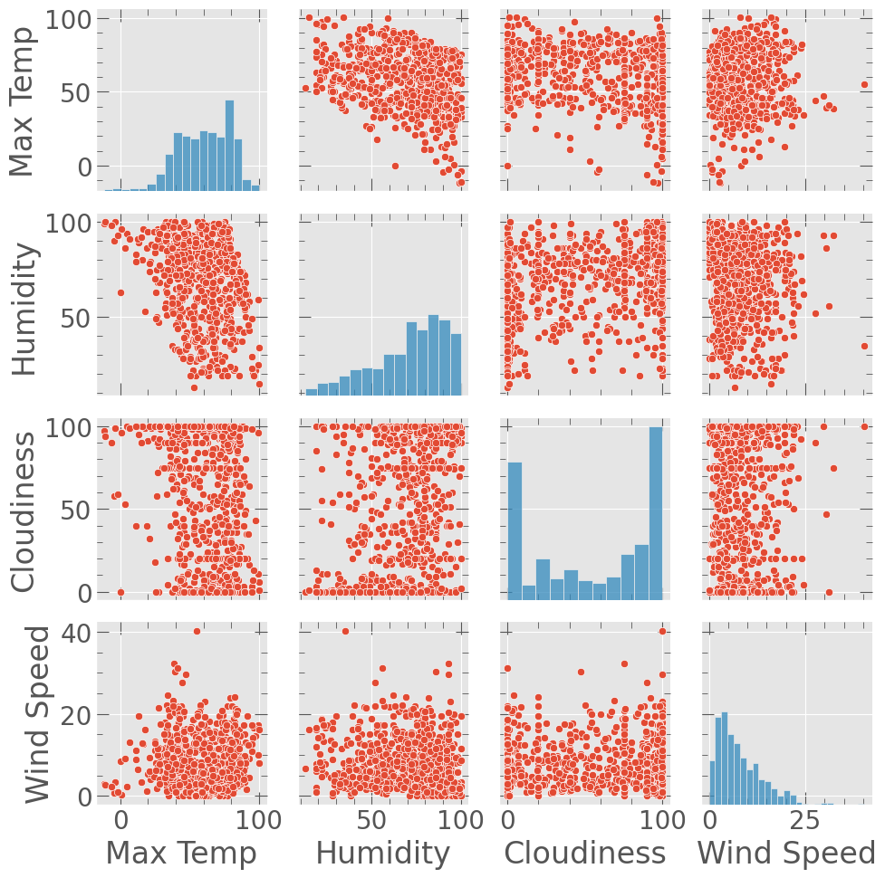
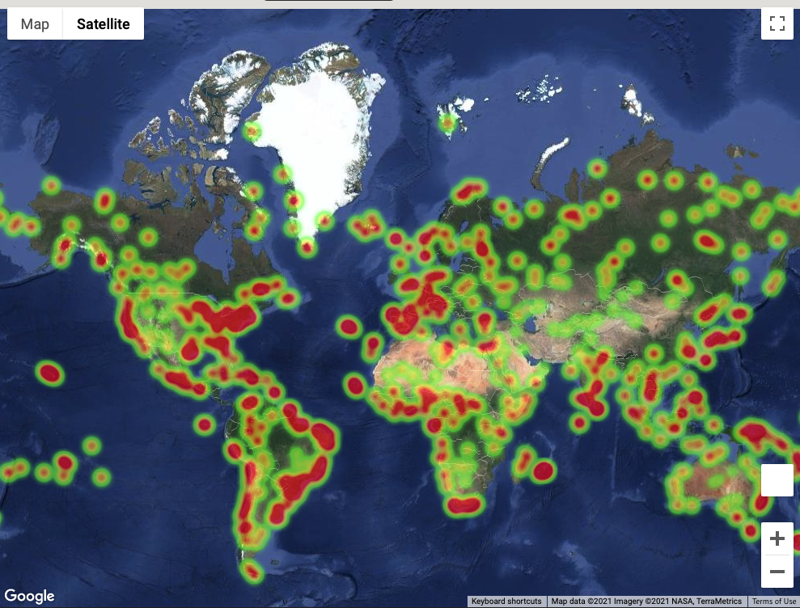
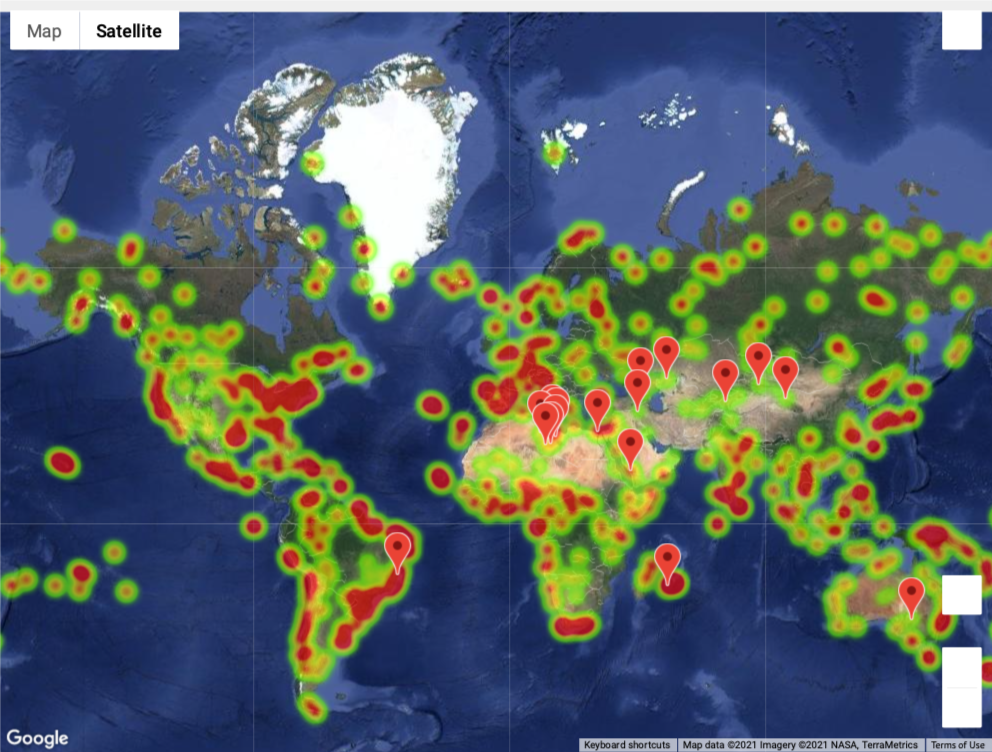

# python-api-challenge- What's the Weather Like?
## Background

Whether financial, political, or social -- data's true power lies in its ability to answer questions definitively. I used Python requests, APIs, and JSON traversals to answer a fundamental question: "What's the weather like as we approach the equator?"

## Part I - WeatherPy

In this example, I have created a Python script to visualize the weather of 500+ cities across the world of varying distance from the equator. To accomplish this, I utilized a [simple Python library](https://pypi.python.org/pypi/citipy), the [OpenWeatherMap API](https://openweathermap.org/api) to create a representative model of weather across world cities.

I have created a series of scatter plots to showcase the following relationships:

* Temperature (F) vs. Latitude
* Humidity (%) vs. Latitude
* Cloudiness (%) vs. Latitude
* Wind Speed (mph) vs. Latitude

Performed a linear regression on each relationship. Also separated the plots into Northern Hemisphere (greater than or equal to 0 degrees latitude) and Southern Hemisphere (less than 0 degrees latitude):

* Northern Hemisphere - Temperature (F) vs. Latitude
* Southern Hemisphere - Temperature (F) vs. Latitude
* Northern Hemisphere - Humidity (%) vs. Latitude
* Southern Hemisphere - Humidity (%) vs. Latitude
* Northern Hemisphere - Cloudiness (%) vs. Latitude
* Southern Hemisphere - Cloudiness (%) vs. Latitude
* Northern Hemisphere - Wind Speed (mph) vs. Latitude
* Southern Hemisphere - Wind Speed (mph) vs. Latitude

### Part II - VacationPy

Used weather data to plan future vacations. Used jupyter-gmaps and the Google Places API for this part.

* Created a heat map that displays the humidity for every city from Part I.

  

* By narrowing down the DataFrame to find  ideal weather condition. 

  * A max temperature lower than 80 degrees but higher than 70.

  * Wind speed less than 10 mph.

  * Zero cloudiness.

 

* Used Google Places API to find the first hotel for each city located within 5000 meters of your coordinates.

* Humidity heatmap with each pin containing the **Hotel Name**, **City**, and **Country**.

  

